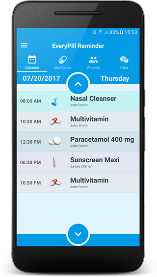

# Calendar

The Calendar tab displays the list of medications that you added, and that have its alarm set.

> Note: Only medicines with the alarm set are listed on the *Calendar* tab.

For each medication with the alarm set, it displays:

- The label **Today** by default, and the label of today's week day. For example: **Monday**
- A list of the meds ordered by the hour that they need to be taken (format HH:MM am/pm)
- The icon of the medicine
- The name of the medicine and the name of the patient - both names given by you when you added the med
- Two navigation buttons, one at the top of the list and another at its bottom

> If you scroll down the navigation button, the day of the week changes from **Today** to the next days, formatted as MM/DD/YYYY.

## Alarm

When it's time to take a medication that has its **alarm set**, the app sends a push notification, vibrates and sounds 3 times.

If your phone is on **vibrate mode**, the alarm will vibrate one time, but it won't sound. Also, it's possible to see the medicine's notification at the notification area of your phone.

If your turn off your phone, the alarm won't vibrate or sound. But, when you turn your phone on, it will vibrate and you will see the late medicine's notification at the notification area of your phone, so you can see what you've missed.

The alarm of a **shared** medications doesn't sound until they're accepted.