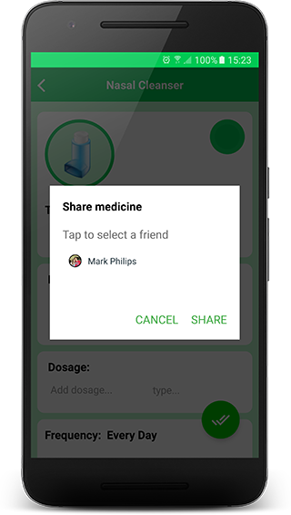

# Medicines

## Add a new medicine

This option allows you to add the medicines that you need to manage for yourself and others. To relate the individual (yourself or others) to the medicine, you just need to type his/her name when adding the new med. 

You can do it with a few simple steps. Let's see how it works?

-----

**1.** From the Medicine's tab, tap **Add** (+)

**2.** On the next screen, you can select a background colour. There are five different colours to help you to better organize your list. Try them out!!

**3.** Select the *type* of medicine from the list. `Required`

You can choose one of these options: Capsule, Cream, Drops, Gel/ Lotion, Inhaler, Injection, Powder, Mouthwash, Spray, Syrup, Tablet, Suppository, Other.

> After selecting the med type, note that its image is changed.

**4.** Add a *name* to the medicine. `Required`

This is for your own information, so you can type a name that is relevant to you.

**5.** Add *dosage* and *type*. `Optional`

The *type* options are: cc, drops, g, mg, mL, pills, spray, tabs, tablespoon, teaspoon, units, other.

**6.** Select the *frequency* to take it. `Required`

There are four options:

- Every day
- Week days
- Days interval
- Weeks interval

After that, select the correspondent *interval* and *time* to start to take it.

**7.** Add the *patient* name. `Required`

Here is where you relate the medicine to the patient. This is for your own information, so you can type a name that is relevant to you.

**8.** Add a *note*. `Optional`

**9.** After fill in all required fields, tap **Save** to add the new medicine.

**Result**

- The medicine is added to the **Medicines** list with its alarm set.
- Message *'Medicine saved'* is displayed.
- The medicine is added to the **Calendar** list.

> All medicines with the alarm set will be listed on the Calendar tab. If the *initial date* is different from the current day, you must scroll down the list until the *initial date* to see the meds on the list.
  
If you don't fill in all the required fields, and tap **Save**, the missing fields are surrounded by a red square.

## List of medicines

The medicine's tab lists all added medication.

The list displays the med's icon, name, and the alarm, that can be ON or OFF.

**When you add a new med, the alarm is set by default. To turn it off, just tap the alarm icon.**

## Edit a medicine

Tap a medicine to edit its information.

On the edition screen, update the required fields and tap the drop-down menu.

From the drop-down menu, select *Save medicine*

| ||

**Result**

- The updated med is on the list of medicines
- Different from when you add a new med, the alarm isn't set by default. It remains like it was before the edition, ON or OFF. 
- Message *'Medicine saved'* is displayed

## Delete a medicine

**1.** To delete a med, tap it from the list of medicines

**2.** On the edition screen, tap the drop-down menu

**3.** From the drop-down menu, select *Remove medicine*

**4.** Message *'Do you want to remove <medicine_name>?'* is displayed

**5.** Tap *OK* to confirm.

**Result**

- You're redirected to medicine's list
- The removed medicine is not on the list anymore.
- Message *'Medicine deleted'* is displayed.

## Share a medicine

- Only users with **Premium** version can share medicines.
- To share a medicine with others, you first need to have friends added to your Friend's list. Refer to section **Friends** to learn more about it.

**1.** Tap a medicine to share its information.

**2.** On the edition screen, tap the drop-down menu

**3.** From the drop-down menu, select *Share medicine*

- A popup is displayed

**4.** On the popup, tap *'Tap to select a friend'*

- The list of friends is displayed

**5.** Select one friend from the list

- The name of the friend is displayed

**6.** Tap *Share*

**Result**

- You are redirected to the list of meds.
- Message *'Medicine shared'* is displayed.

> You can only share one medicine at a time with the **same friend**. If you try to share a second medicine with someone, and he/she didn't respond (Accept or Reject) your previous request yet, the message: *'Your friend must first respond to the previous request'* is displayed

## Respond to a request

When someone shares a medicine with you, you will see the suggested med on the list. The shared med is surrounded by a red line, and it contains the buttons *Accept* and *Reject*.

The alarm for a shared med won't sound until you accept the request.

To **accept** a request, tap *Accept*

Message *'Do you want to add (medicine's name) sent by (friend's name)?'* is displayed.

Tap [OK] to accept it.

**Result**

- The medicine remains on the list, and its alarm is set
- Buttons *Accept* and *Reject* are removed
- Message *'Medicine added'* is displayed

To **reject** a request, tap *Reject*

Message *'Do you want to remove (medicine's name) sent by (friend's name)?'* is displayed

Tap [OK] to reject it

**Result**

- The medicine is removed from the list
- Message *'Medicine deleted* is displayed

> Remember that while you don't respond to your friend's request, either accepting or rejecting it, he/she won't be able to share another medicine with you.